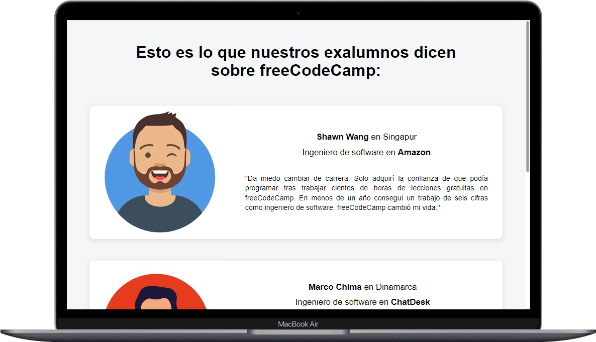

# Práctica testimonios freeCodeCamp 👨‍💻

Este proyecto es una aplicación sencilla de React que muestra testimonios de tres personas, tomando inspiración de los testimonios de freeCodeCamp.

El proyecto es del [curso gratuito de React](https://www.youtube.com/watch?v=6Jfk8ic3KVk) en el canal de YouTube de [freeCodeCamp en Español](https://www.freecodecamp.org/espanol/). 

La aplicación presenta un título y tres cajas, cada una con la imagen (avatar), nombre, profesión y testimonio de una persona. Es un proyecto inicial para aprender y practicar [React](https://react.dev/).

La estructura inicial fue creada con el comando `npx create-react-app`.

## Características
En la aplicación añadí mejoras tomando algunos de los consejos propuestos en el curso. Las siguientes características las cuales añadí de manera personal para mejorar la aplicación son:

- Responsive: La aplicación se adapta a diferentes tamaños de pantalla, desde móviles hasta escritorios.

- Dinámica: El contenido de los testimonios se maneja de forma dinámica mediante un array de objetos para facilitar futuras actualizaciones.

## Instalación
Para ejecutar este proyecto localmente, sigue estos pasos:

1.  Clona el repositorio.  `git clone`

2. Instala las dependencias:  `npm install`

3. Inicia la aplicación: `npm start`

La aplicación se abrirá automáticamente en el navegador configurado por defecto y se ejecutará en `localhost:3000`.

## Preview
Esto es una captura de pantalla de cómo se ve la apliación creada.

## Tecnologías
[React](https://react.dev/)

[CSS](https://developer.mozilla.org/es/docs/Web/CSS)

[JavaScript](https://developer.mozilla.org/es/docs/Web/JavaScript)